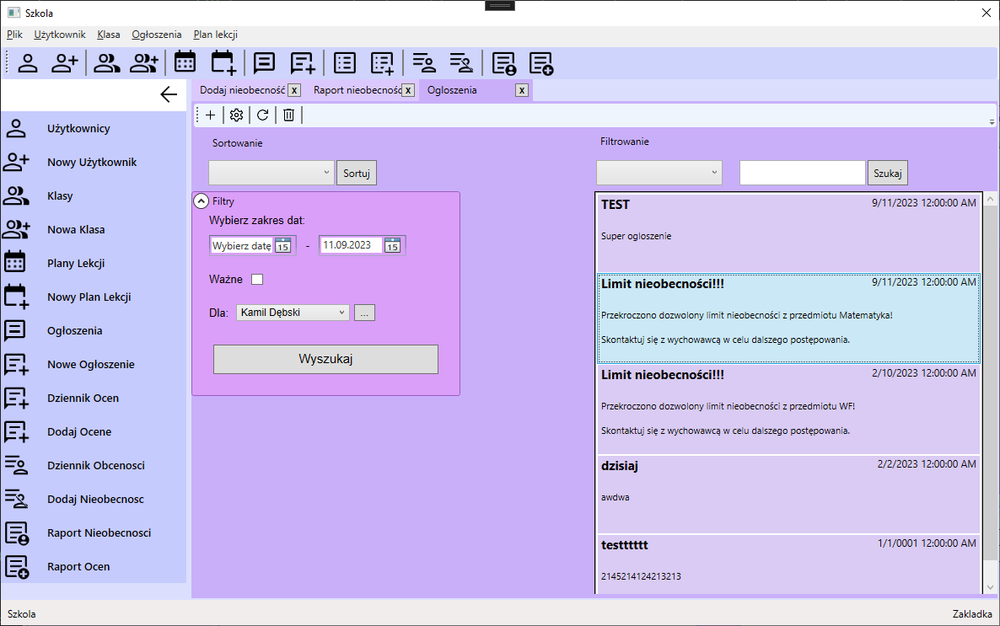

# School
"School" aplikacja desktopowa stworzona w technologii WPF, zaprojektowana do zarządzania szkołą, stworzona na potrzeby projektu szkolnego.

## Wykorzystane technologie:

**Frontend**
- XAML
- WPF

**Backend**
- C#
- T-SQL
- MVVM

## Opis aplikacji:

**Funkcje aplikacji:**
- Zarządzanie uczniami i nauczycielami
  - Dodawanie i usuwanie informacji o uczniach i nauczycielach.
  - Przeglądanie danych osobowych, kontaktowych uczniów oraz nauczycieli.
- Planowanie lekcji
  - Tworzenie i zarządzanie planem lekcji dla różnych klas.
  - Monitorowanie dostępności nauczycieli i sal lekcyjnych.
- Oceny i raporty
  - Wprowadzanie ocen dla uczniów w różnych przedmiotach.
  - Generowanie raportów dotyczących postępów uczniów.
- Nieobecności i obecności
  - Rejestracja nieobecności uczniów i powiadamianie uczniów o przekroczeniu dopuszczalnej ilości nieobecności.
  - Monitorowanie obecności uczniów.
- Komunikacja i ogłoszenia
  - Wysyłanie wiadomości i ogłoszeń do uczniów i nauczycieli.
  - Powiadamianie o ważnych wydarzeniach i zmianach w szkole.

## Wygląd aplikacji:

    

Obraz 1. Wyszukiwanie użytkowników.

----

    

Obraz 2. Edycja planu lekcji.

----

    

Obraz 3. Oceny.

----

    

Obraz 4. Raport ocen.

----

    

Obraz 5. Dodawanie nieobecności.

----

    

Obraz 6. Raport nieobecności.

----

    

Obraz 7. Dodawanie ogłoszeń.

----

    

Obraz 8. Ogłoszenia dla użytkownika.

